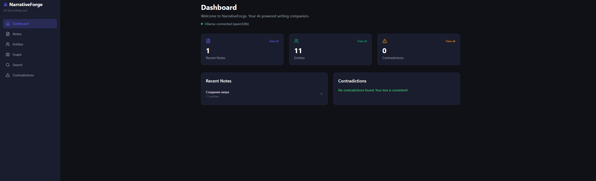
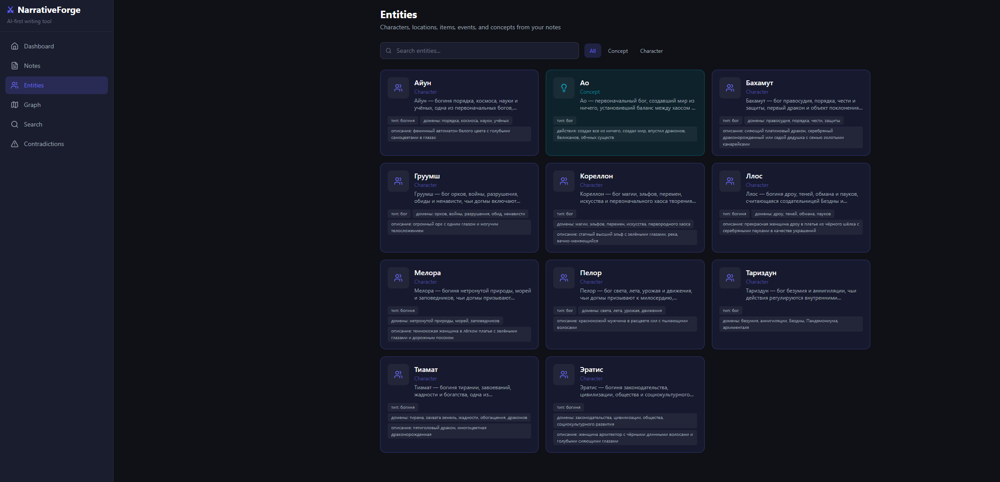
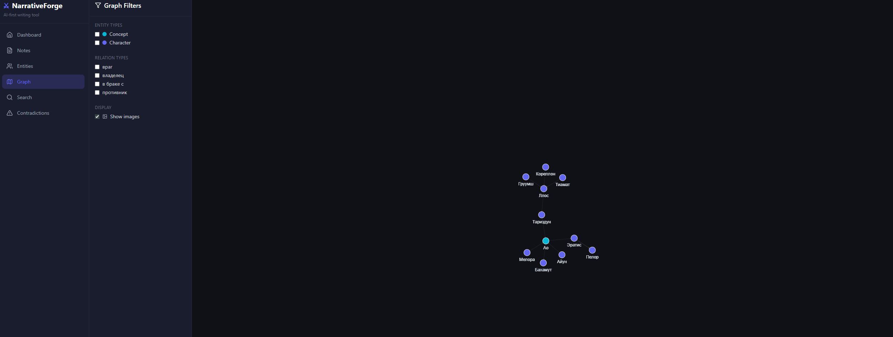

# NarrativeForge

AI-first workspace for writers and tabletop RPG game masters—notes, automatic entity extraction, relationship graphs, and contradiction checks powered by a local LLM.

## Screenshots

| Main menu | Entities | Graph |
|-----------|----------|-------|
|  |  |  |

## What it does

- **Notes** — write free-form blocks (cities, characters, events)
- **NER + relationship graph** — the LLM extracts entities and builds a graph of how they connect
- **Contradiction search** — surfaces mismatches in your lore (e.g. eye color conflicts)
- **Entity cards** — each entity gets a card with attributes, optional image, and links
- **Interactive graph** — explore connections with filters

## Stack

- **Frontend**: Next.js 14, TailwindCSS, TypeScript  
- **Backend**: Python FastAPI  
- **Database**: SQLite  
- **LLM**: [Ollama](https://ollama.ai) with `qwen3:8b` (configurable)

## Requirements

- Python 3.10+
- Node.js 18+
- [Ollama](https://ollama.ai) with model `qwen3:8b` pulled and the Ollama server running

## Ollama setup

```bash
# Install Ollama from https://ollama.ai, then start the server
ollama serve

# In another terminal — pull the model
ollama pull qwen3:8b
```

## First-time setup

From the `narrative-forge` folder (in **PowerShell**, use the `.\` prefix for local scripts):

```bash
# Option A — automated (Windows)
.\setup.bat

# Option B — manual
cd backend
pip install -r requirements.txt

cd ../frontend
npm install
```

## Run the app

```bash
# Option A — starts backend + frontend in separate windows (Windows)
.\start.bat

# Option B — two terminals
# Terminal 1 — API (port 8001 matches frontend/next.config.js rewrites)
cd backend
python -m uvicorn main:app --reload --host 0.0.0.0 --port 8001

# Terminal 2 — web UI
cd frontend
npm run dev
```

- **App**: [http://localhost:3000](http://localhost:3000)  
- **OpenAPI docs**: [http://localhost:8001/docs](http://localhost:8001/docs)

## Usage

1. Open **Notes** and create a note  
2. Write prose (character, location, event, etc.)  
3. Click **Analyze** — the LLM extracts entities and relations  
4. Open **Entities** — review and enrich cards (images via drag & drop)  
5. Open **Graph** — visualize the full relationship graph with filters  
6. Check **Contradictions** for flagged inconsistencies  

## Project layout

```
narrative-forge/
├── backend/
│   ├── main.py               # FastAPI entry
│   ├── database.py           # SQLite
│   ├── models.py             # ORM models
│   ├── schemas.py            # Pydantic schemas
│   ├── routers/              # API routes
│   ├── services/
│   │   ├── llm_client.py     # Ollama client
│   │   └── note_processor.py # NER + contradiction pipeline
│   └── prompts/              # Prompt templates
├── frontend/
│   └── app/
│       ├── page.tsx          # Dashboard
│       ├── notes/            # Notes editor
│       ├── entities/         # Entity cards
│       ├── graph/            # Graph view
│       └── contradictions/   # Contradictions UI
├── main_menu.png             # README screenshots
├── entities.png
├── graph.png
├── setup.bat                 # First-time deps
└── start.bat                 # Run API + web
```
